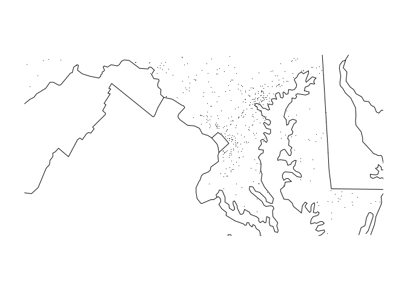

This package helps users to read the files in the directory and
summarise number of accidents by month and year. The package contains
the functions fars\_read(), make\_filename(), fars\_read\_years(),
fars\_summarize\_years() and fars\_map\_state().

We'll be explaining each function with examples.

### fars\_read()

This is a simple function that reads a file by taking filename as input.
If a filename doesn't exist in the working directory then the function
stops with the message "file 'filename' does not exist".

    fars_read('accident_2013.csv.bz2')
    #> # A tibble: 30,202 x 50
    #>    STATE ST_CASE VE_TOTAL VE_FORMS PVH_INVL  PEDS PERNOTMVIT PERMVIT
    #>    <int>   <int>    <int>    <int>    <int> <int>      <int>   <int>
    #>  1     1   10001        1        1        0     0          0       8
    #>  2     1   10002        2        2        0     0          0       2
    #>  3     1   10003        1        1        0     0          0       1
    #>  4     1   10004        1        1        0     0          0       3
    #>  5     1   10005        2        2        0     0          0       3
    #>  6     1   10006        2        2        0     0          0       3
    #>  7     1   10007        1        1        0     0          0       1
    #>  8     1   10008        2        2        0     0          0       2
    #>  9     1   10009        1        1        0     0          0       1
    #> 10     1   10010        2        2        0     0          0       4
    #> # ... with 30,192 more rows, and 42 more variables: PERSONS <int>,
    #> #   COUNTY <int>, CITY <int>, DAY <int>, MONTH <int>, YEAR <int>,
    #> #   DAY_WEEK <int>, HOUR <int>, MINUTE <int>, NHS <int>, ROAD_FNC <int>,
    #> #   ROUTE <int>, TWAY_ID <chr>, TWAY_ID2 <chr>, MILEPT <int>,
    #> #   LATITUDE <dbl>, LONGITUD <dbl>, SP_JUR <int>, HARM_EV <int>,
    #> #   MAN_COLL <int>, RELJCT1 <int>, RELJCT2 <int>, TYP_INT <int>,
    #> #   WRK_ZONE <int>, REL_ROAD <int>, LGT_COND <int>, WEATHER1 <int>,
    #> #   WEATHER2 <int>, WEATHER <int>, SCH_BUS <int>, RAIL <chr>,
    #> #   NOT_HOUR <int>, NOT_MIN <int>, ARR_HOUR <int>, ARR_MIN <int>,
    #> #   HOSP_HR <int>, HOSP_MN <int>, CF1 <int>, CF2 <int>, CF3 <int>,
    #> #   FATALS <int>, DRUNK_DR <int>

### make\_filename()

This is a simple function that creates a filename in the ".csv.bz2"
format starting with "accident\_" for a given year.

    make_filename(2018)
    #> [1] "accident_2018.csv.bz2"

### fars\_read\_years()

This function let's us read multiple files by just inputting the years
for which we want to read files. It generates a list of data frames,
where each file is a data frame that's part of the list.

    fars_read_years(c(2013, 2014, 2015))
    #> Loading required package: magrittr
    #> [[1]]
    #> # A tibble: 30,202 x 2
    #>    MONTH  year
    #>    <int> <dbl>
    #>  1     1 2013.
    #>  2     1 2013.
    #>  3     1 2013.
    #>  4     1 2013.
    #>  5     1 2013.
    #>  6     1 2013.
    #>  7     1 2013.
    #>  8     1 2013.
    #>  9     1 2013.
    #> 10     1 2013.
    #> # ... with 30,192 more rows
    #> 
    #> [[2]]
    #> # A tibble: 30,056 x 2
    #>    MONTH  year
    #>    <int> <dbl>
    #>  1     1 2014.
    #>  2     1 2014.
    #>  3     1 2014.
    #>  4     1 2014.
    #>  5     1 2014.
    #>  6     1 2014.
    #>  7     1 2014.
    #>  8     1 2014.
    #>  9     1 2014.
    #> 10     1 2014.
    #> # ... with 30,046 more rows
    #> 
    #> [[3]]
    #> # A tibble: 32,166 x 2
    #>    MONTH  year
    #>    <int> <dbl>
    #>  1     1 2015.
    #>  2     1 2015.
    #>  3     1 2015.
    #>  4     1 2015.
    #>  5     1 2015.
    #>  6     1 2015.
    #>  7     1 2015.
    #>  8     1 2015.
    #>  9     1 2015.
    #> 10     1 2015.
    #> # ... with 32,156 more rows

### fars\_summarize\_years()

This function calculates a summary of total accidents by month and year.

    fars_summarize_years(c(2013, 2014, 2015))
    #> # A tibble: 12 x 4
    #>    MONTH `2013` `2014` `2015`
    #>    <int>  <int>  <int>  <int>
    #>  1     1   2230   2168   2368
    #>  2     2   1952   1893   1968
    #>  3     3   2356   2245   2385
    #>  4     4   2300   2308   2430
    #>  5     5   2532   2596   2847
    #>  6     6   2692   2583   2765
    #>  7     7   2660   2696   2998
    #>  8     8   2899   2800   3016
    #>  9     9   2741   2618   2865
    #> 10    10   2768   2831   3019
    #> 11    11   2615   2714   2724
    #> 12    12   2457   2604   2781

### fars\_map\_state()

This function let's us show accidents by exact location in a state
within a year on a map. If there are no accidents for a state in a year,
then a message "no accidents to plot" would vbe shown. The "state.num"
should be valid otherwise the function would stop and show the message
"invalid STATE number: 'state.num'".

    fars_map_state(24, 2013)

